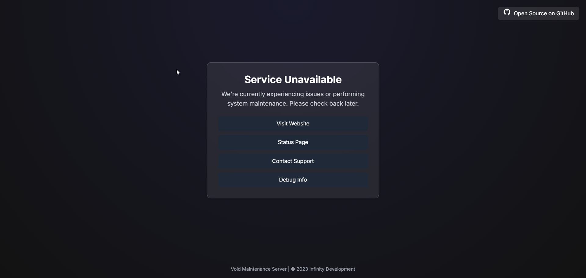
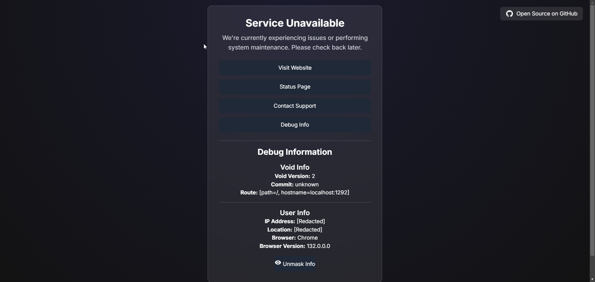

# Void
`Void` is an open-source maintenance system developed by `Infinity Development`. It is designed to provide a seamless and efficient way to manage and communicate the status of various services during maintenance periods or outages. Built with scalability and performance in mind, `Void` leverages the power of Go to ensure quick response times and reliable operation.

## Features
- **Scalability**: Designed to handle a large number of services efficiently.
- **Maintainability**: Clean and modular codebase for easier updates and maintenance.
- **Speed**: Improved performance with Go's concurrency model.

---

## Preview
Here are some preview images of the `Void` maintenance system:




---

## Setting Up Void with Nginx
To set up `Void` as a maintenance system under the `_maint` location in Nginx, follow these steps:

1. **Install Nginx**: Ensure that Nginx is installed on your server. You can install it using your package manager. For example, on Ubuntu:
   ```sh
   sudo apt update
   sudo apt install nginx
   ```

2. **Configure Nginx**: Edit your Nginx configuration file (usually located at `/etc/nginx/nginx.conf` or `/etc/nginx/sites-available/default`) to include void, you can find a template config [here](./temp/nginx.conf)

> **NOTE**: the default port for void is `1292` but this can be changed [here](./main.go#L224)

---

## Setting up Void with systemd
To set up `Void` to run as a systemd service, follow these steps:

1. **Create a systemd Service File**: Create a new service file for `Void` at `/etc/systemd/system/void.service`, we have a template service pre-ready for you [here](./temp//void.service)

> Replace `/your/path/to/void` with the actual path to your Void executable and adjust the User and Group and Start `After` service/target as needed.


2. **Reload systemd**: Reload the systemd manager configuration to apply the new service file:
   ```sh
   sudo systemctl daemon-reload
   ```

3. **Enabled and Start the Service**: Enable the service to start on boot and start it immediately:
   ```sh
   sudo systemctl enable void.service
   sudo systemctl start void.service
   ```

4. **Check the Service Status**: Verify that the service is running correctly:
   ```sh
   sudo systemctl status void.service
   ```

With this setup, Void will run as a systemd service, starting automatically at boot and restarting on failure.

---

## Starting the Void Server
To run the project locally, follow these steps:

1. **Install Dependencies and Build Void**
  ```sh
  make
  ```

2. **Run the Void Server**
  ```sh
  ./void
  ```

---

## Configuring Services
> **NOTE**: you should also change the fallback services [here](./main.go#L175)

```yml
services:
  - name: "Some Website"
    domain: "example.com"
    support: "https://discord.gg/23h82fh48f"
    status: "https://status.example.com"

apiUrls:
  - "api.example.com"
```

---

## Debug Information
The web interface provides a "Debug Info" button that expands to show detailed information about the service and user. This includes:

- Void Info: Version, commit, and route information.
- User Info: IP address, location, browser, and browser version.

---

## Contributing

We welcome contributions from the community to help improve `Void`. If you would like to contribute, please follow these steps:

1. **Fork the Repository**: Click the "Fork" button at the top right of this repository to create a copy of the repository on your GitHub account.

2. **Clone the Repository**: Clone the forked repository to your local machine using the following command:
   ```sh
   git clone https://github.com/your-username/void.git
   ```

3. **Create a Branch**: Create a new branch for your feature or bug fix:
   ```sh
   git checkout -b feature-or-bugfix-name
   ```

4. **Make Changes**: Make your changes to the codebase.

5. **Commit Changes**: Commit your changes with a descriptive commit message:
   ```sh
   git commit -m "Description of the feature or bug fix"
   ```

6. **Push Changes**: Push your changes to your forked repository:
   ```sh
   git push origin feature-or-bugfix-name
   ```

7. **Create a Pull Request**: Open a pull request from your forked repository to the main repository. Provide a clear description of your changes and any relevant information.

8. **Review Process**: Your pull request will be reviewed by the maintainers. Please be responsive to any feedback or requests for changes.

Thank you for contributing to Void! Your efforts help make this project better for everyone.

---

## License
This project is open source and available under the MIT License.

---

## Acknowledgements
- [Tailwind CSS](https://tailwindcss.com/)
- [Iconify](https://iconify.design/)
- [ipapi](https://ipapi.co/)